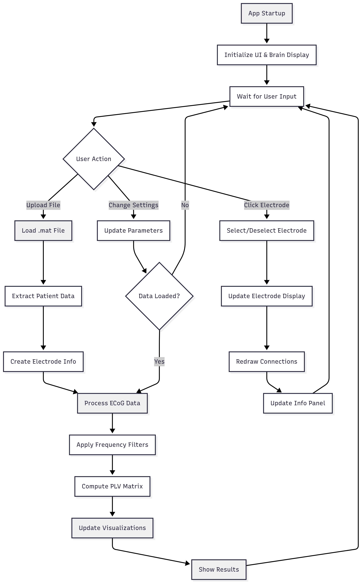

# PLView

PLView is a MATLAB App Designer application for visualizing ECoG (electrocorticography) functional connectivity using Phase Locking Value (PLV). It provides an interactive 3D brain view and a 2D connection graph to explore phase–amplitude coupling between electrode pairs across user-selected frequency bands and test conditions.


## What's in this repo

- **PLView.mlapp** — App Designer source (binary). Required at runtime: `head3d.mat`, `PLView_icon.png`, `PLView_logo.png`, `upload.png` in the same folder.
- **PLView_code_snapshot.m** — Exported app code for reading without opening the .mlapp.
- **docs/** — [User guide](docs/user_guide.md), [developer notes](docs/developer_notes.md), and [dependencies/paths](docs/DEPENDENCIES.md).
- **assets/** — Screenshots and diagram for documentation.
- **data/** — Demo `.mat` files for testing (user selects file via the app).

### Repository structure

```text
final/
├── README.md
├── LICENSE
├── .gitignore
├── CITATION.cff
├── PLView.mlapp
├── PLView.prj
├── head3d.mat
├── PLView_icon.png
├── PLView_logo.png
├── upload.png
├── PLView_code_snapshot.m
├── assets/
│   ├── demo_6_channels.jpg
│   └── Diagram.png
├── data/
│   ├── 4channels_2017_02.mat
│   ├── 8channels_2017_07.mat
│   └── testing_test_test_2017_02.mat
└── docs/
    ├── user_guide.md
    ├── developer_notes.md
    └── DEPENDENCIES.md
```

## Features

- **Test Condition:** Rest, Easy Task (CountF), Hard Task (Alt).
- **Phase and Amp Frequencies:** Two dropdowns (Delta, Theta, Alpha, Beta, Gamma, High Gamma).
- **Selected Electrode Role:** Phase (low frequency) or Amplitude (high frequency).
- **Electrodes Labels:** Toggle to show/hide labels on 3D and 2D views.
- **Upload (.mat file):** Load ECoG data; app computes PLV and updates visualizations.
- **3D brain view:** Electrodes and connectivity on a brain mesh; rotate and click electrodes.
- **2D connection graph:** Circular layout with PLV colorbar; click electrodes to inspect strongest connection.
- **Info panel:** Patient ID, electrode count, strongest connection (PLV value, electrode pair, network).


## Requirements

- **MATLAB:** R2024b recommended; R2022b has been reported to work (see project documentation).
- **Signal Processing Toolbox:** Used for bandpass filtering and Hilbert transform in `processECOGData`. The app may rely on other toolboxes as needed.

## How to run

- **Recommended (easiest):** Install PLView from the **MATLAB File Exchange (App Exchange)**: [https://www.mathworks.com/matlabcentral/fileexchange/182041-plview](https://www.mathworks.com/matlabcentral/fileexchange/182041-plview). This is the best way to use the app without managing source files.
- **To edit the app source:** Open `PLView.mlapp` in MATLAB App Designer. The app folder must contain `head3d.mat`, `PLView_icon.png`, `PLView_logo.png`, and `upload.png`, and electrode metadata must be available as documented under Environment & Data Requirements.
- **To read the code without editing:** Open `PLView_code_snapshot.m` in MATLAB or any text editor; the .mlapp does not need to be opened.

## Input data format

### User .mat file (selected via Upload)

- Must contain a struct/object with field **data_all**.
- **data_all** must have fields: **all_rest**, **all_countF**, **all_alt** (matching the Test Condition dropdown).
- Each field is a **cell array of trials**. Each trial is a matrix **n_electrodes × n_samples** (numeric).
- The **patient identifier** is taken from the **filename**: the 7 characters immediately before `.mat` (e.g. `something_2017_02.mat` → `2017_02`). This must match a subject in the electrode metadata table.
- The app assumes a **sampling rate of 2000 Hz** (set in `startupFcn`).

### Electrode metadata (external file)

The app loads an electrode table from a **hardcoded path** (see Environment & Data Requirements). That file must contain a table **elecs_n79** with columns:

- **subject** — Patient ID (must match the filename-derived ID).
- **contact** — Contact index; value 4 is treated as reference and excluded.
- **x_MNI_coord**, **y_MNI_coord**, **z_MNI_coord** — 3D coordinates.
- **channel** or **elec_name** — Electrode/channel identifier.
- **Network** — Network label (e.g. for coloring).

## Environment & Data Requirements

- **Electrode metadata path (hardcoded in app):**  
  In `PLView_code_snapshot.m` (line 58) the app runs:  
  `ElectrodesData = load("/mnt/jane_data/DataFromMoataz/Elecs_n79_w_network.mat");`  
  The app expects this file at that path. To run from source without changing code, place a copy of the electrode metadata file at `/mnt/jane_data/DataFromMoataz/Elecs_n79_w_network.mat`, or create a symlink. The file must contain the **elecs_n79** table with the columns listed above.

- **head3d.mat:**  
  Must be in the **same folder as PLView.mlapp** (or on the MATLAB path). Used for the 3D brain mesh. Must contain **head3d.cortex.mesh** with fields **.vertices** and **.faces**. If missing, the app falls back to a sphere.

- **PLView.prj:**  
  The project file may contain deployment paths (e.g. project root and MATLAB root). If you open the project in MATLAB, you may need to repoint those paths to your environment.

## Privacy

This repository does not include patient data. Demo/sample data (e.g. in `data/`) is for testing only. Use only in accordance with your institution’s data and ethics policies.

## Limitations

- **App Designer:** Part of the app logic is generated and not freely editable (e.g. callback signatures).
- **MATLAB version:** Behavior may differ across MATLAB releases (e.g. R2022b vs R2024b).
- **Data and environment:** The app depends on the lab electrode metadata path and the expected .mat structure; it is not a generic ECoG viewer without those.
- **Toolboxes:** Signal Processing Toolbox is required; other toolboxes may be used.

## Workflow diagram



## Citation / acknowledgments

If you use PLView in research, please cite appropriately (e.g. the MATLAB File Exchange page or this repository). Author and contact: Yuval Zur (yuvalzzur@gmail.com). See [CITATION.cff](CITATION.cff) if present.
